# Build Your Voice-Based Physical AI Companion Yourself

**From digital intelligence to physical presence.**

In this workshop, you will create a physical AI companion that can listen, speak, and respond with a custom persona. By the end, your R1 development kit will be paired with an AI character in Bot Station and ready for live voice conversations.

The experience comes together in three layers:

1. **Persona:** define your AI character.
2. **Voice:** give the character the ability to listen and speak.
3. **Body:** run the experience on real R1 hardware.

## Workshop Flow

| Section | Focus | Outcome |
| --- | --- | --- |
| 1 | Introduction | Understand the path from digital intelligence to physical presence. |
| 2 | Preparations | Confirm that your account, R1, and USB cable are ready. |
| 3 | Meet R1 | Learn the hardware architecture and main controls. |
| 4 | Character setup | Create and preview your AI character in Bot Station. |
| 5 | Flash, pair, and run | Flash the R1, connect it to your bot, and activate it. |
| 6 | Explore more | Extend the project with source code, voice features, and MCP tools. |

## 1. From Digital Intelligence to Physical Presence

You are building a Jarvis-like physical AI companion with a custom persona, a conversational voice, and an R1 hardware body.

Links:

- [Visit Agora](https://www.agora.io/en/)
- [Visit RiseLink](https://www.riselink.ai/)
- [Visit Robotics Fair 2026](https://robotfaire.org/)

## 2. Prepare Your Workshop Kit

Make sure the account, R1, and cable are ready before the live setup begins.

- Computer with internet access
- [Agora account](https://console.agora.io/) for Console login
- One R1 (BK7258) development kit
- USB cable for device flashing
- [Agora account](https://console.agora.io/), [Sign Up](https://sso2.agora.io/en/signup) if you don't have it
- Create a project and make sure "Conversational AI Engine" is enabled(enabled by default if new created project)
- Access to [Bot Station](https://botstation.sg3.agoralab.co/)

Agora Physical AI connects AI systems to real-world devices so hardware can listen, speak, understand, and act. RiseLink supports the workshop with connectivity expertise across Wi-Fi 6, Bluetooth, Thread, and AI-integrated chips.

Open these services before setup:

1. [Agora Console](https://console.agora.io/)
2. [RiseLink](https://www.riselink.ai/)
3. [Bot Station](https://botstation.sg3.agoralab.co/)

## 3. Meet the R1 Voice Device

The R1 development kit is the physical interface for your AI character. It provides Wi-Fi connectivity, voice input, speaker output, and the controls needed for flashing and pairing.

For a deeper hardware guide, see the [official R1 demo documentation](https://docs.agora.io/en/ai/device-kit/build/run-r1-demo).

### Hardware Architecture

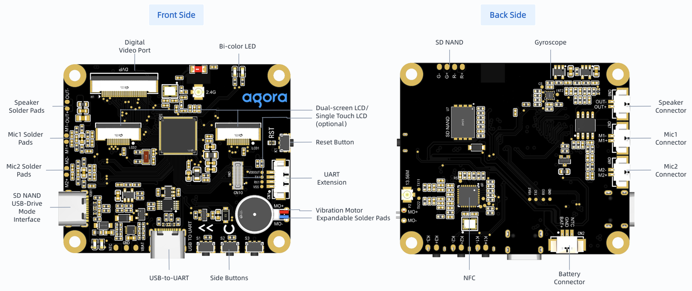

### Main Controls

- **Reset:** restart the board or enter the flashing flow.
- **Pair:** start the local hotspot used during setup.
- **Activate:** launch the paired bot session.

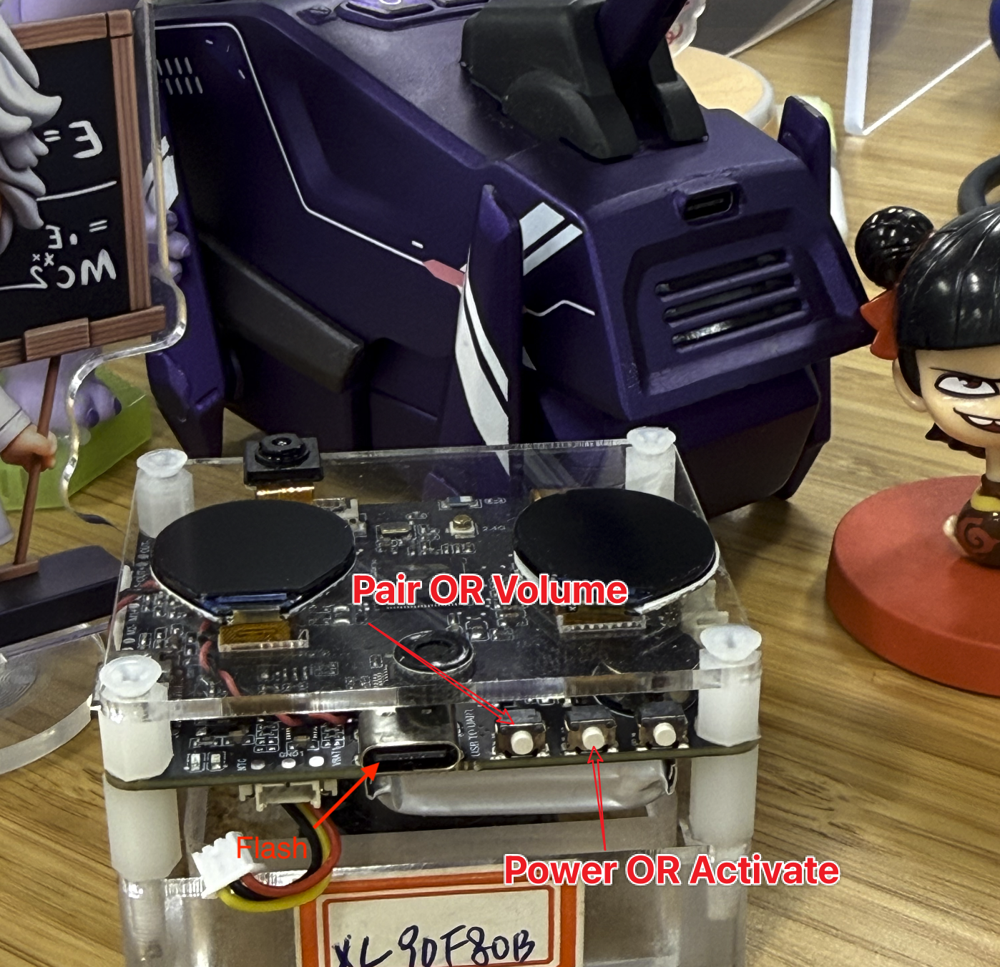

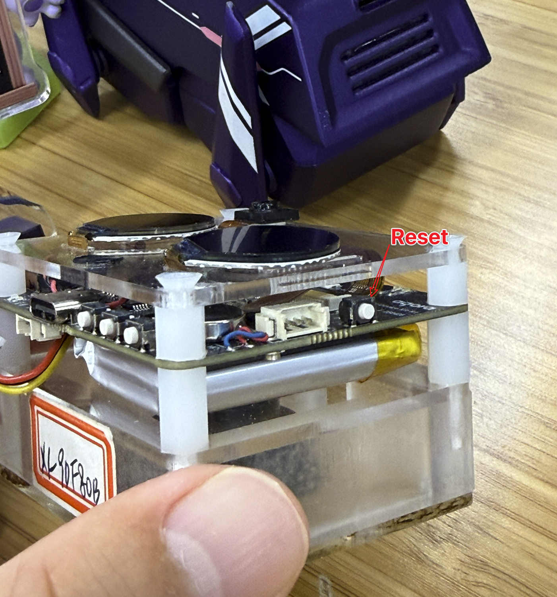

## 4. Create Your AI Character

Use Bot Station to define how your physical AI behaves, speaks, and greets users.

### Open Bot Station

1. Visit [Bot Station](https://botstation.sg3.agoralab.co/).
2. Sign in with your Agora account.
3. Confirm that the Bot Station home page opens.

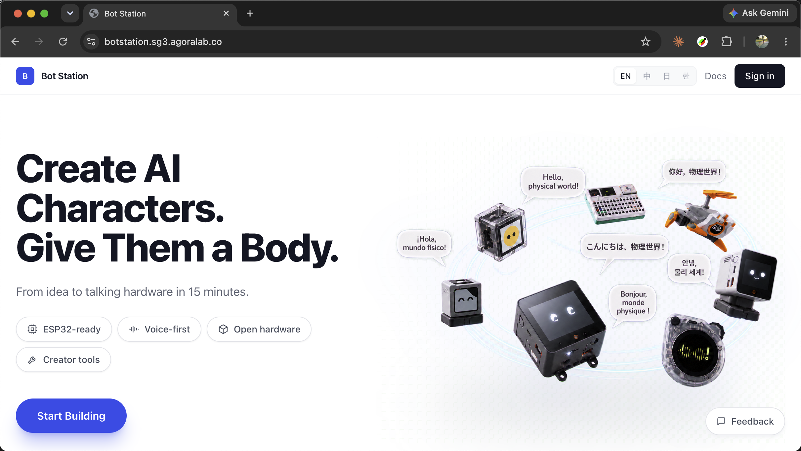

### Create a New Bot

1. Create a new bot.
2. Select the Agora project you want to use.
3. Continue to character setup.

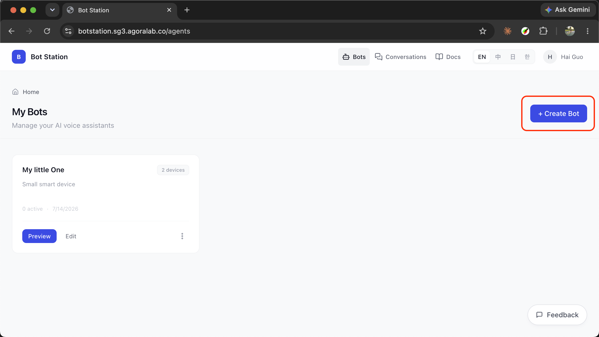

### Configure the Character

- **Bot name:** choose a recognizable name, such as `Workshop Companion`.
- **Persona:** describe the character, expertise, and tone.
- **Language:** choose the conversation language.
- **Voice:** select an available text-to-speech voice.
- **System prompt:** define behavior, boundaries, and knowledge scope.
- **Welcome message:** write the first message spoken after activation.
- **Filler words:** add short phrases for moments when a response is still being generated.
- **MCP server:** optionally connect tools that can retrieve data or perform actions.

Example persona:

```text
 A warm, helpful workshop assistant who gives concise, practical instructions and encourages hands-on exploration. Uses approachable language and short sentences.
```

Example system prompt:

```text
You are a friendly workshop assistant running on a small voice device. Keep answers short, practical, and easy to understand. Explain the next workshop step clearly when asked.
```

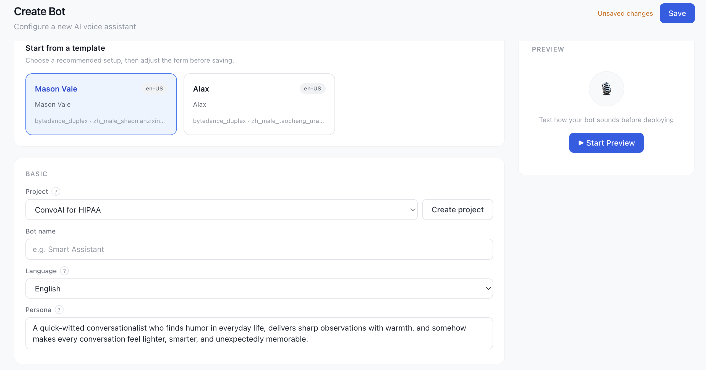

### Save and Preview

1. Save the bot.
2. Open Preview.
3. Test a short conversation in the web client.
4. Confirm that the persona, language, and voice sound correct.

Try these prompts:

```text
Hello, who are you?
What can you help me with?
Explain this workshop in one sentence.
```

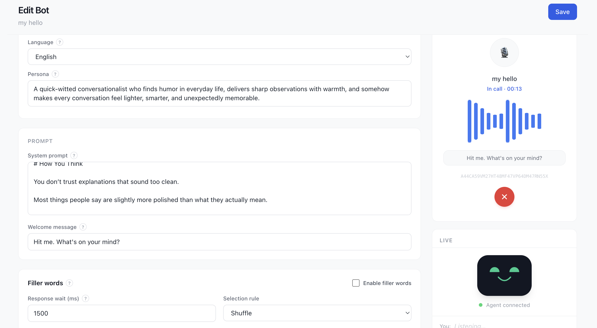

## 5. Flash, Pair, and Run

Open your bot in **My Bots**, choose **Add device**, pick and download the firmware for R1, then select one of the two flashing workflows.

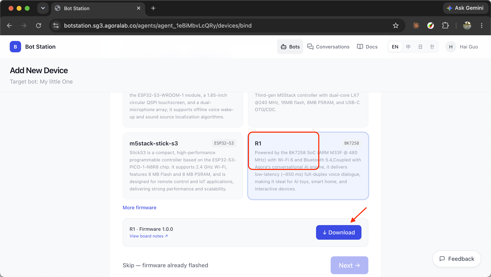

### Tooling Guidance

- **Claude Code or Codex CLI:** prefer `bk_loader` for flashing and a terminal-based serial monitor such as `tio` for logs. CLI output lets the agent verify the port, detect failures, and repeat the exact command during troubleshooting.
- **Human-led setup:** prefer the web flasher for a guided workflow that requires no installation. Use the desktop GUI when a local visual tool is more convenient.
- **Serial port access:** close the serial monitor before flashing, then reopen it after flashing completes. The flasher and monitor cannot use the same port at the same time.
- **Before running a command:** verify the serial port and firmware path instead of copying the examples unchanged.

### Option A: Web Flasher

The [web flash tool](https://connect.aclsemi.com/download) runs in your browser. It does not require an app download or installation.

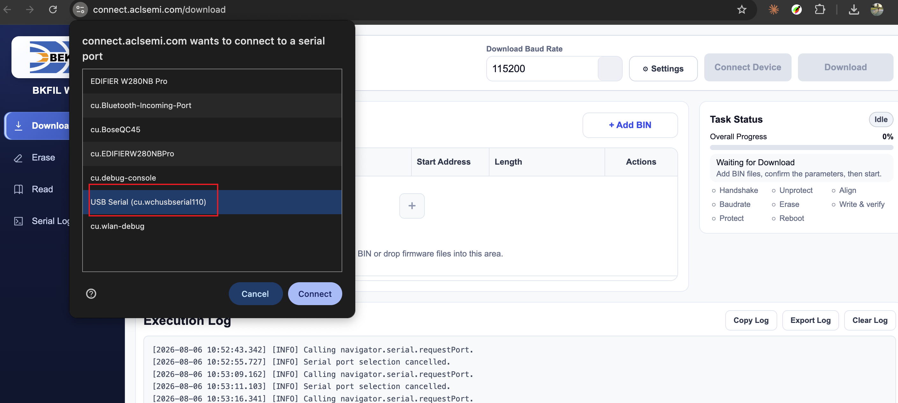

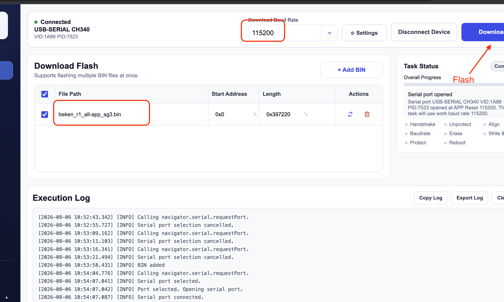

### Option B: Desktop Flasher

Download the dedicated GUI app or CLI from the [Beken flashing tools page](https://dl.bekencorp.com/tools/bkfil/v4) for a local flashing workflow.

### Flash the Firmware

1. Connect the R1 to your computer with the USB cable.
2. Select the correct COM or serial port.
3. Set the baud rate to `115200`.
4. Select the R1 firmware image and start flashing.
5. Press Reset when instructed.
6. Wait for the flashing process to finish successfully.

Confirm that the CLI is available:

```bash
$ bk_loader --version
bk_loader, version 4.1.3.168
```

Update the serial port and firmware image path, then run:

```bash
bk_loader download \
  --portnum /dev/cu.wchusbserial110 \
  --baudrate 115200 \
  --infile /path/to/beken_r1_all-app_sg3.bin \
  --startaddr 0x0 \
  --pre_erase 1 \
  --reboot
```

The deck also provides this command from the small **AI** button beside **Download required**, with a button for copying it.


1. Connect the R1 to your computer with the USB cable.
2. Select the correct COM or serial port.
3. Set the baud rate to `115200`.
4. Select the R1 firmware image and start flashing.
5. Press Reset when instructed.
6. Wait for the flashing process to finish successfully.

### Pair and Activate

1. Press and hold Pair on the R1.
2. Connect your computer to the Wi-Fi hotspot created by the R1.
3. Open `http://192.168.4.1/` if the configuration page does not open automatically.
4. Return to Bot Station and copy the pairing code.
5. Enter the pairing code on the R1 configuration page.
6. Submit the form and wait for pairing to complete.
7. Press Activate and begin a voice conversation.

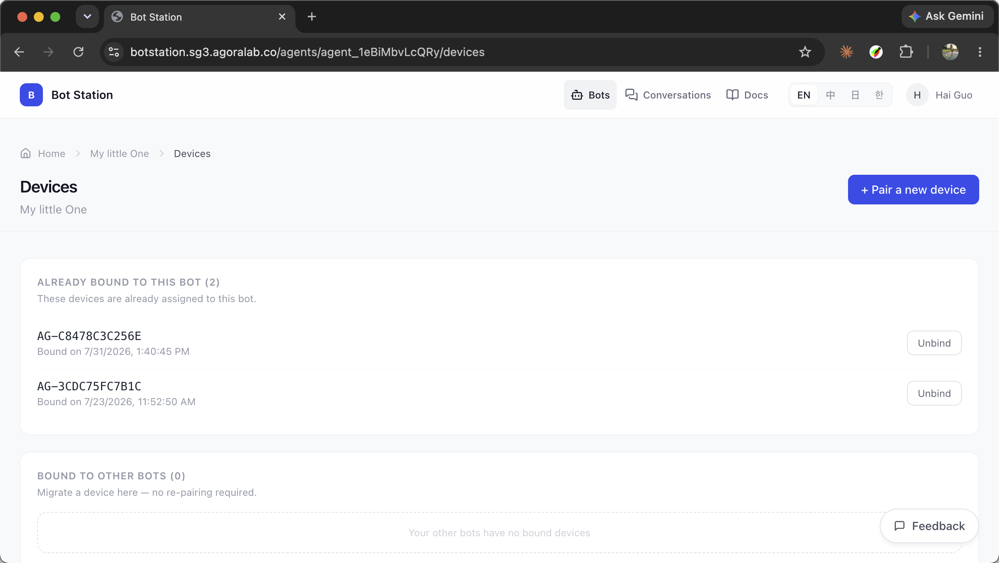

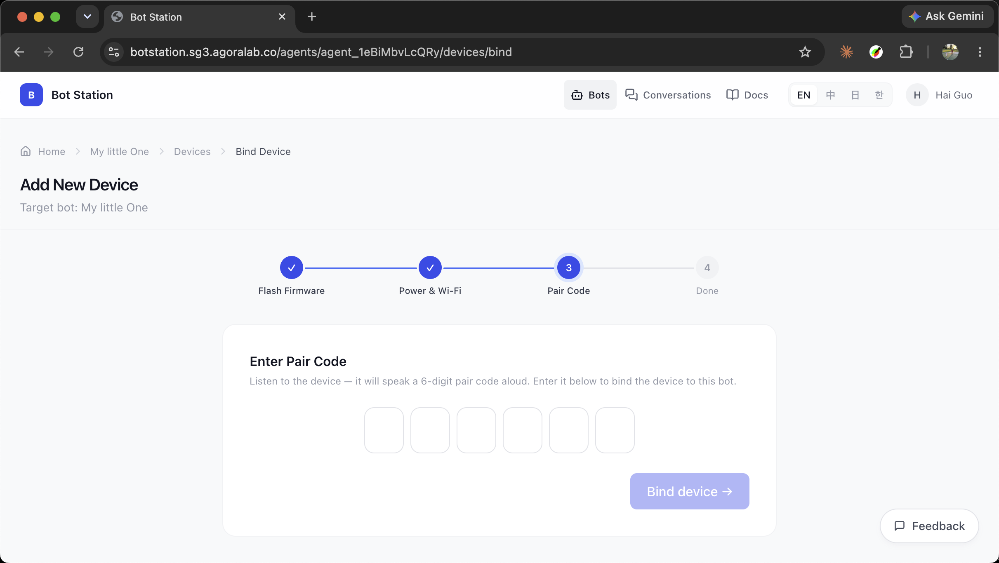

Suggested voice tests:

```text
Hi, introduce yourself.
What should I do next in this workshop?
Tell me one fun fact about physical AI.
```

## 6. Explore More

Once the R1 is working, continue with these extensions:

- **Source code:** clone and modify the [open-source R1 firmware project](https://github.com/harold-2022-cloud/beken-agora-mybot/tree/main).
- **Voice locking:** explore identity-aware interactions for personalized device experiences.
- **Voice clone:** coming soon.
- **Tool actions:** connect MCP tools so the device can retrieve external data or trigger services.

### Free Weather MCP Sample

The [official TypeScript Weather MCP sample](https://github.com/modelcontextprotocol/quickstart-resources/tree/main/weather-server-typescript) runs locally over stdio and uses the free US National Weather Service API.

- MCP transport: `stdio: node .../weather/build/index.js`
- Weather data endpoint: `https://api.weather.gov`
- Cost: free public data
- API key: not currently required
- Available tools: `get_forecast` and `get_alerts`

Install and build the sample, then add it to your MCP client configuration:

```json
{
  "mcpServers": {
    "weather": {
      "command": "node",
      "args": ["/ABSOLUTE/PATH/weather/build/index.js"]
    }
  }
}
```

See the [official MCP server tutorial](https://modelcontextprotocol.io/docs/develop/build-server) and the [NWS API documentation](https://www.weather.gov/documentation/services-web-api) for implementation details and usage policies.

Join other voice AI builders in the Agora Discord community:


## Troubleshooting

| Problem | What to Check |
| --- | --- |
| Computer cannot find the R1 | Reconnect the USB cable, try another USB port, or confirm the serial driver is installed. |
| Flashing does not start | Confirm the port and `115200` baud rate, then press Reset when prompted. |
| Pairing page does not open | Connect to the R1 hotspot and manually open `http://192.168.4.1/`. |
| Cannot connect to Wi-Fi | Confirm the access point supports 2.4 GHz Wi-Fi, the antenna is connected securely, and the password is correct. |
| Pairing code fails | Get the code on screen or from configuration page and put into Bot Station again. |
| Bot does not respond | Confirm Wi-Fi is configured, the bot is saved, and the R1 is activated. |
| Voice sounds wrong | Recheck the selected text-to-speech voice in Bot Station. |

## Completion Checklist

- AI character is created and saved in Bot Station.
- Bot preview works in the web client.
- R1 firmware flashing completes successfully.
- R1 enters pairing mode and opens the configuration page.
- Pairing code is accepted.
- Activate starts the bot session.
- The physical AI companion can listen, respond, and speak aloud.
