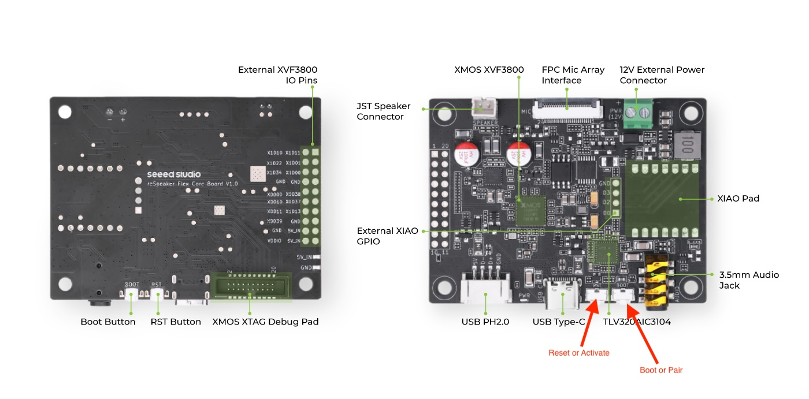
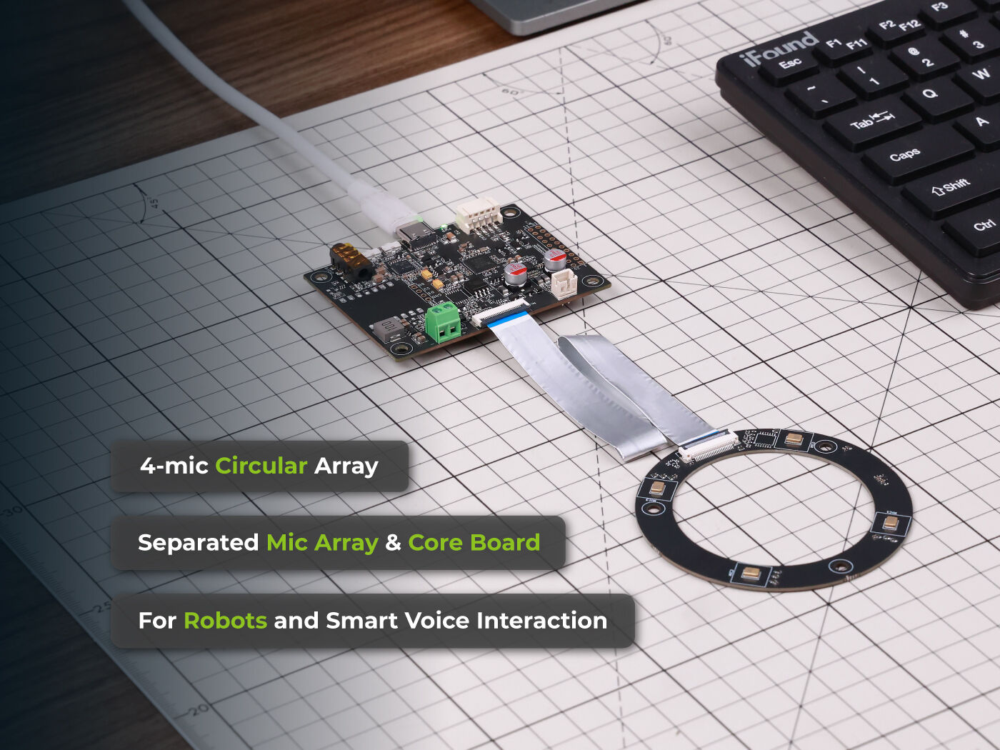
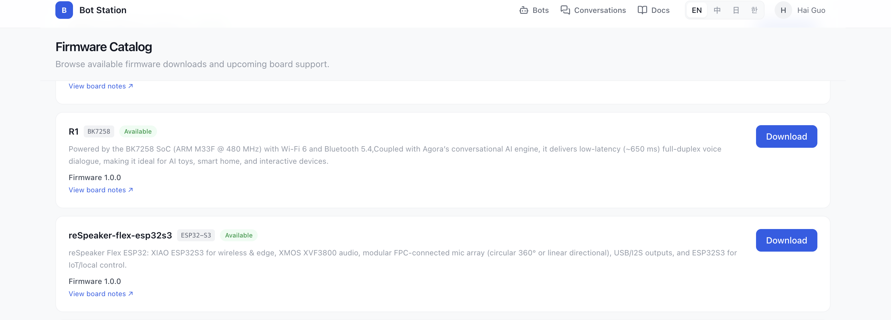

# Give the Body a Brain

**Turn ReSpeaker Flex into a Baymax-like AI companion that listens, thinks, speaks, and acts.**

In this second Robotics Fair 2026 workshop, you will connect a physical voice device to conversational intelligence. By the end, your ReSpeaker Flex will be paired with an AI character in Bot Station and ready to listen, think, speak, and act through tool integrations.

The experience comes together in three layers:

1. **Persona:** define your AI character.
2. **Voice:** give the character the ability to listen and speak.
3. **Body:** run the experience on real ReSpeaker hardware.

## Workshop Deck

Open [index.html](index.html) to use the six-section presentation deck. Move forward or backward with the arrow keys, WASD, the mouse wheel, or a touch swipe. When advancing, workshop screenshots open as full-screen image slides.

## Workshop Flow

| Section | Focus | Outcome |
| --- | --- | --- |
| 1 | Introduction | Understand how ReSpeaker Flex gives an AI character a physical voice and presence. |
| 2 | Preparations | Confirm that your account, ReSpeaker Flex, and USB cable are ready. |
| 3 | Meet ReSpeaker Flex | Learn the hardware architecture and main controls. |
| 4 | Character setup | Create and preview your AI character in Bot Station. |
| 5 | Flash, pair, and run | Flash ReSpeaker Flex, connect it to your bot, and activate it. |
| 6 | Explore more | Extend the project with source code, voice features, and MCP tools. |

## 1. Give the Body a Brain

You are building a Baymax-like physical AI companion with a custom persona, conversational voice, and ReSpeaker hardware body.

Workshop links:

- [Agora](https://www.agora.io/en/)
- [Seeed Studio](https://www.seeedstudio.com/)
- [Robotics Fair 2026](https://robotfaire.org/)

## 2. Prepare Your Workshop Kit

Make sure the account, ReSpeaker Flex, and cable are ready before the live setup begins.

- Computer with internet access
- [Agora account](https://console.agora.io/) for Console login
- One ReSpeaker Flex with XIAO ESP32-S3
- USB cable for device flashing
- Access to [Bot Station](https://botstation.sg3.agoralab.co/)

Agora Physical AI connects AI systems to real-world devices so hardware can listen, speak, understand, and act. Seeed Studio brings ReSpeaker Flex, XIAO ESP32-S3, and the XVF3800 circular four-microphone array together for robotics and embodied AI.

Open these services before setup:

1. [Agora Console](https://console.agora.io/)
2. [Seeed Studio](https://www.seeedstudio.com/)
3. [Bot Station](https://botstation.sg3.agoralab.co/)

## 3. Meet ReSpeaker Flex

ReSpeaker Flex is the physical interface for your AI character. It provides Wi-Fi connectivity, far-field voice input, speaker output, and the controls needed for flashing and pairing.


### Hardware Architecture



### Main Controls

- **Reset:** restart the board.
- **Activate:** launch the paired bot session.
- **Pair:** start the local hotspot used during setup.




## 4. Create Your AI Character

Use Bot Station to define how your physical AI behaves, speaks, and greets users.

### Open Bot Station

1. Visit [Bot Station](https://botstation.sg3.agoralab.co/).
2. Sign in with your Agora account.
3. Confirm that the Bot Station home page opens.


### Create a New Bot

1. Create a new bot.
2. Select the Agora project you want to use.
3. Continue to character setup.


### Configure the Character

- **Bot name:** choose a recognizable name, such as `Workshop Companion`.
- **Persona:** describe the character, expertise, and tone.
- **Language:** choose the conversation language.
- **Voice:** select an available text-to-speech voice.
- **System prompt:** define behavior, boundaries, and knowledge scope.
- **Welcome message:** write the first message spoken after activation.
- **Filler words:** add short phrases for moments when a response is still being generated.
- **MCP server:** optionally connect tools that can retrieve data or perform actions.

Example system prompt:

```text
You are a friendly workshop assistant running on a small voice device. Keep answers short, practical, and easy to understand. Explain the next workshop step clearly when asked.
```

### Save and Preview

1. Save the bot.
2. Open Preview.
3. Test a short conversation in the web client.
4. Confirm that the persona, language, and voice sound correct.

Try these prompts:

```text
Hello, who are you?
What can you help me with?
Explain this workshop in one sentence.
```

## 5. Flash, Pair, and Run

Open your bot in **My Bots**, choose **Add device**, then select one of the two flashing workflows.

### Option A: Web Flasher

The [web flash tool](https://thelastoutpostworkshop.github.io/ESPConnect/) runs in your browser. It does not require an app download or installation.

### Option B: esptool

Install Espressif [esptool](https://docs.espressif.com/projects/esptool/en/latest/esp32/) for a local flashing workflow.

Update the serial port and firmware image path, then run:

```bash
esptool -p /dev/cu.wchusbserial1320 -b 460800 write_flash --erase-all 0x0 /path/to/respeaker-flex-agora-mybot.bin
```

The deck also provides this command from the small **AI** button beside **Download required**, with a button for copying it.

### Flash the Firmware

1. Connect ReSpeaker Flex to your computer with the USB cable.
2. Select the correct COM or serial port.
3. Set the baud rate to `460800`.
4. Select the ReSpeaker firmware image and start flashing.
5. Wait for the flashing process to finish successfully.

### Optional: XVF3800 I2S Firmware

The XIAO ESP32-S3 communicates with the XVF3800 microphone array over I2S. Flash the separate I2S firmware if the device still uses its factory USB firmware or produces loud static or noise instead of clear microphone audio. Skip this update when I2S audio is already clean.

1. Connect your computer to the XMOS USB-C port near the RST button, not the XIAO USB-C port.
2. Install [`dfu-util`](http://dfu-util.sourceforge.net/): on Windows, download version 0.11, extract the `win64` directory, and add it to the system `Path`; use `brew install dfu-util` on macOS or `sudo apt install dfu-util` on Linux.
3. Run `dfu-util -l` to confirm that the XVF3800 is detected.
4. If it is not detected, hold the Boot button while reconnecting power to enter Safe Mode. On Windows, install the WinUSB driver with [Zadig](https://zadig.akeo.ie/) if `dfu-util` reports a USB access error.
5. Download [`respeaker_flex_i2s_c16k2ch_v1.0.0.bin`](https://github.com/respeaker/reSpeaker_Flex/raw/refs/heads/main/xmos_firmwares/i2s/respeaker_flex_i2s_c16k2ch_v1.0.0.bin) from the official GitHub repository and run:

```bash
dfu-util -R -e -a 1 -D /path/to/respeaker_flex_i2s_c16k2ch_v1.0.0.bin
```

See the [official ReSpeaker Flex firmware guide](https://wiki.seeedstudio.com/respeaker_flex_introduction/#update-firmware) for Windows setup and recovery details.



### Pair and Activate

1. Press and hold Boot / Pair on ReSpeaker Flex.
2. Connect your computer to the Wi-Fi hotspot created by ReSpeaker Flex.
3. Open `http://192.168.4.1/` if the configuration page does not open automatically.
4. Wait for ReSpeaker Flex to connect to Wi-Fi and speak its pairing code.
5. Return to Bot Station and enter the spoken pairing code.
6. Submit the form and wait for pairing to complete.
7. Press Reset to activate the bot and begin a voice conversation.


Suggested voice tests:

```text
Hi, introduce yourself.
What should I do next in this workshop?
Tell me one fun fact about physical AI.
```

## 6. Explore More

Once ReSpeaker Flex is working, continue with these extensions:

- **Source code:** clone and modify the [open-source ReSpeaker firmware project](https://github.com/qiuyanli1990/respeaker-flex-circle-Agora-mybot).
- **Voice locking:** explore identity-aware interactions for personalized device experiences.
- **Voice clone:** coming soon.
- **Tool actions:** connect MCP tools so the device can retrieve external data or trigger services.

### Free Weather MCP Sample

The [official TypeScript Weather MCP sample](https://github.com/modelcontextprotocol/quickstart-resources/tree/main/weather-server-typescript) runs locally over stdio and uses the free US National Weather Service API.

- MCP transport: `stdio: node .../weather/build/index.js`
- Weather data endpoint: `https://api.weather.gov`
- Cost: free public data
- API key: not currently required
- Available tools: `get_forecast` and `get_alerts`

Install and build the sample, then add it to your MCP client configuration:

```json
{
  "mcpServers": {
    "weather": {
      "command": "node",
      "args": ["/ABSOLUTE/PATH/weather/build/index.js"]
    }
  }
}
```

See the [official MCP server tutorial](https://modelcontextprotocol.io/docs/develop/build-server) and the [NWS API documentation](https://www.weather.gov/documentation/services-web-api) for implementation details and usage policies.

Join other voice AI builders in the Agora Discord community:


## Troubleshooting

| Problem | What to Check |
| --- | --- |
| Computer cannot find ReSpeaker Flex | Reconnect the USB cable, try another USB port, or confirm the serial driver is installed. |
| Flashing does not start | Confirm the serial port and `460800` baud rate, then retry the flash command. |
| Pairing page does not open | Connect to the ReSpeaker hotspot and manually open `http://192.168.4.1/`. |
| Pairing code fails | Copy a new code from Bot Station and make sure there are no extra spaces. |
| Bot does not respond | Confirm Wi-Fi is configured, the bot is saved, and ReSpeaker Flex is activated. |
| Voice sounds wrong | Recheck the selected text-to-speech voice in Bot Station. |

## Completion Checklist

- AI character is created and saved in Bot Station.
- Bot preview works in the web client.
- ReSpeaker firmware flashing completes successfully.
- ReSpeaker Flex enters pairing mode and opens the configuration page.
- Pairing code is accepted.
- Activate starts the bot session.
- The physical AI companion can listen, respond, and speak aloud.
